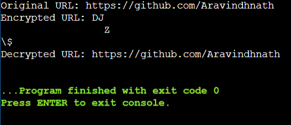

# EX-8 : ADVANCED ENCRYPTION STANDARD (AES) ALGORITHM

## Aim:
  To use Advanced Encryption Standard (AES) Algorithm for a practical application like URL Encryption.

## ALGORITHM: 
  1. AES is based on a design principle known as a substitution–permutation. 
  2. AES does not use a Feistel network like DES, it uses variant of Rijndael. 
  3. It has a fixed block size of 128 bits, and a key size of 128, 192, or 256 bits. 
  4. AES operates on a 4 × 4 column-major order array of bytes, termed the state

## PROGRAM: 
```C
#include <stdio.h>
#include <string.h>

void xor_encrypt_decrypt(char *input, char *key)
 {
    int input_len = strlen(input);
    int key_len = strlen(key);

    for (int i = 0; i < input_len; i++)
    {
         input[i] = input[i] ^ key[i % key_len]; // XOR encryption
    }
}

int main()
{
   char url[] = "https://github.com/Aravindhnath";
   char key[] = "secretkey"; // Simple key for XOR encryption

   printf("Original URL: %s\n", url);

   // Encrypt the URL
   xor_encrypt_decrypt(url, key);
   printf("Encrypted URL: %s\n", url);

   // Decrypt the URL (since XOR is reversible using the same key)
   xor_encrypt_decrypt(url, key);
   printf("Decrypted URL: %s\n", url);

   return 0;
}

```
## OUTPUT:


## RESULT: 
   Thus , to use Advanced Encryption Standard (AES) Algorithm for a practical application like URL Encryption is done successfully.
